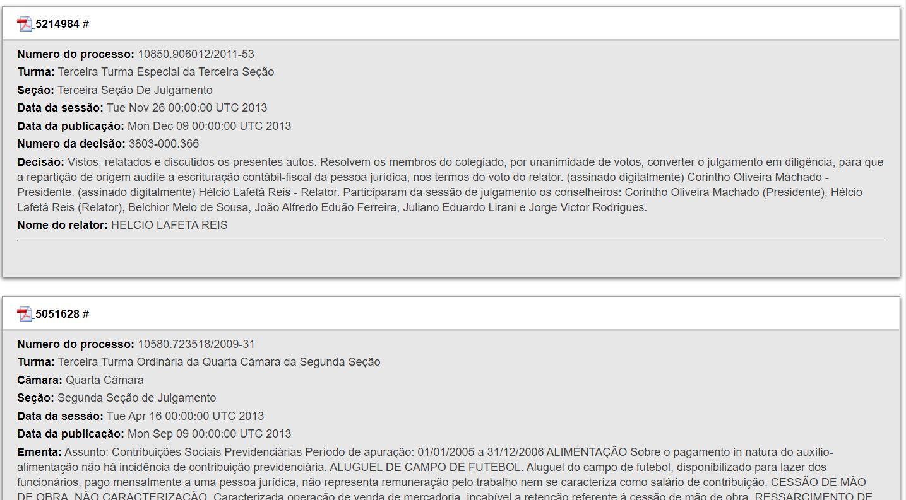
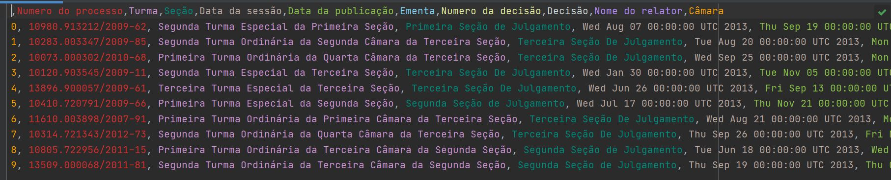

# Tax-Decision-Scrap
## 💻 About this project (sobre este projeto)
:us: This project aimed to scrap the public Tax Administrative Decisions from the Brazilian Higher Chamber of the Administrative Tax Appeals Council ("CSRF") website, and save them in a CSV file.

:brazil: Este projeto teve por objetivo obter as decisões públicas do website Conselho Administrativo de Recursos Fiscais (CARF), e salvá-las em um documento CSV.

---
## ⚙️ Project demonstration (demontração do projeto)
The algorithm scraps the public Tax Administrative Decisions from the Brazilian Higher Chamber of the Administrative Tax Appeals Council ("CSRF") website, and save them in a CSV file.

- Example of original data structure:
<p align="center"> 

- Example of result:
<p align="center"> 

This project was developed using Selenium, as an instrument to open the Browser, navigate in the HTML DOM, and scrape the data.

Finally, an example of data scraped can be seen here: [tax-decision.csv](./tax-decision.csv)

---
	
## 💡 Knowledge acquired (conhecimentos adquiridos)

- During this project, I learned:
  - to scrape dynamic pages, that changes their data and structures randomly;
  - to scrape data organized in a list structure instead of a table structure.
  - to apply Object-Oriented Programming (OOP) to code reusable pieces of code blueprints; 
  - about Xpath and its structure, using it to navigate in the HTML DOM; and
  - the concepts of axis (relationship between nodes on DOM) to navigate the structure and get the data needed.

---

## 🚀 How to execute this project (como executar este projeto)

 - To run the code it is recommended to use an IDE, such as Pycharm;
  - Just clone this project, open on your IDE, and run.

### 🎲 Requirements (requisitos)

To run the code, it is recommended to install the following Python Packaged:
beautifulsoup4==4.9.3
bs4==0.0.1
certifi==2020.12.5
chardet==4.0.0
idna==2.10
numpy==1.20.2
pandas==1.2.4
python-dateutil==2.8.1
pytz==2021.1
requests==2.25.1
selenium==3.141.0
six==1.15.0
soupsieve==2.2.1
urllib3==1.26.4

#### Running the codes (rodando os códigos)

```bash

# Clone this repository
$ gh repo clone rosadigital/Tax-Decision-Scrap
# Open the repository on pycharm

```

---

## 🦸 Author (autor)


Felipe Rosa on [LinkedIn](https://www.linkedin.com/in/felipe-rosa/)

---

## 📝 License (licença)

This project is licensed under [MIT](./LICENSE).

Este projeto esta sobe a licença [MIT](./LICENSE).

Made with ❤️ by Felipe Rosa 👋🏽 [Contact here!](https://www.linkedin.com/in/felipe-rosa/)

Feito com ❤️ por Felipe Rosa 👋🏽 [Entre em contato!](https://www.linkedin.com/in/felipe-rosa/)

--
